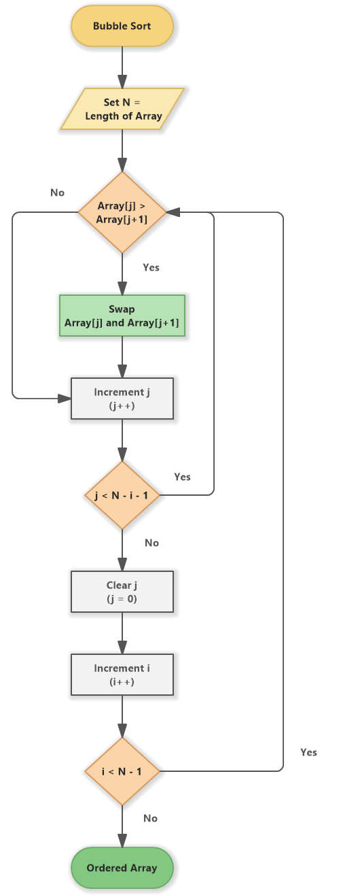
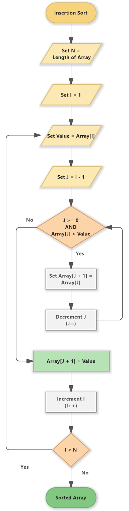
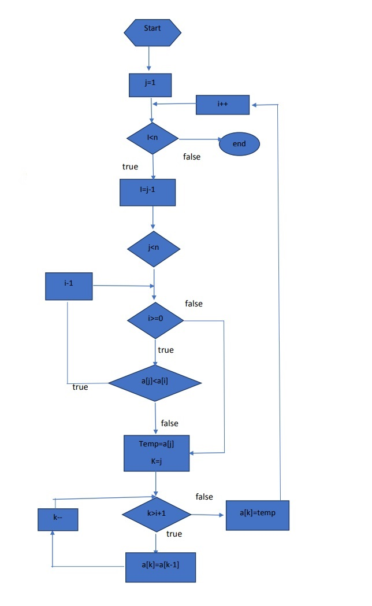
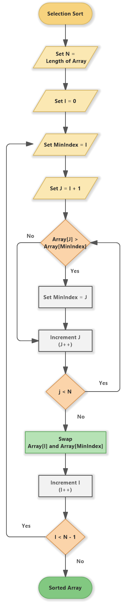
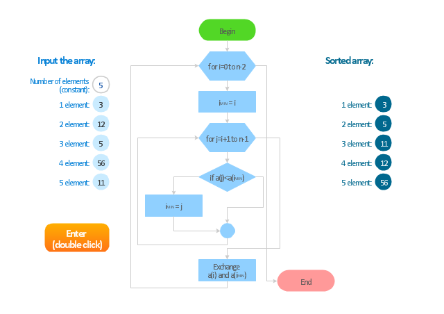
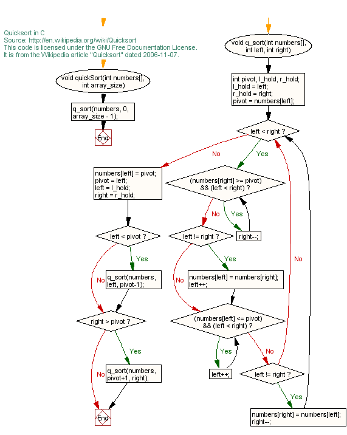
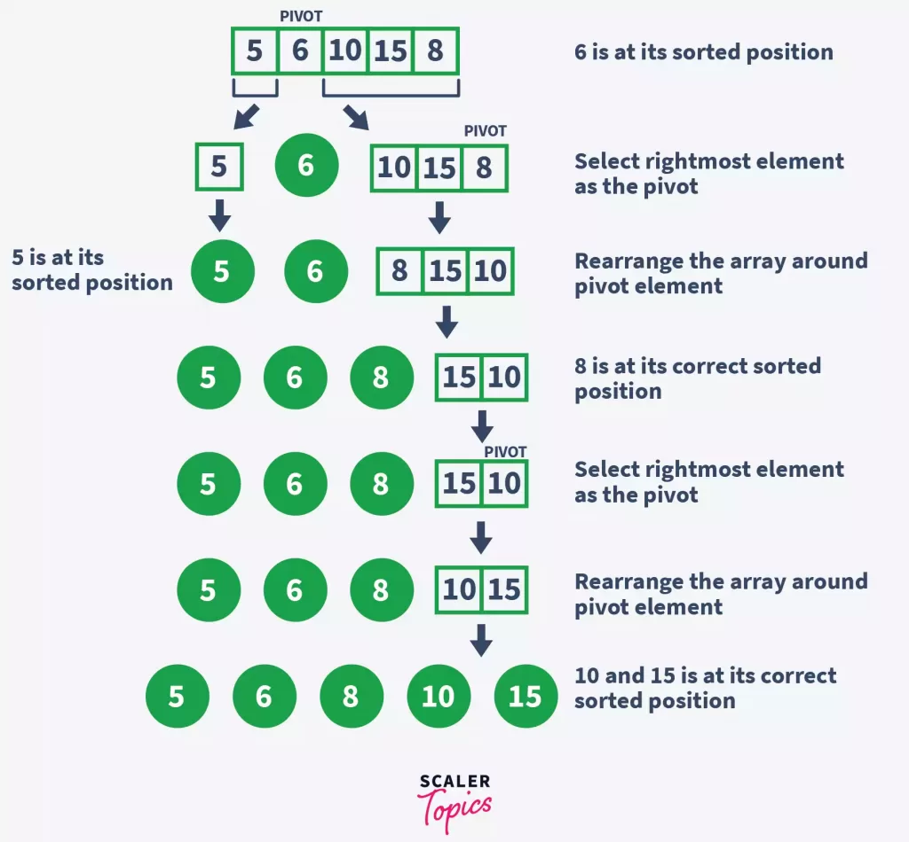

# holbertonschool-sorting_algorithms
C - Sorting algorithms &amp; Big O

#Bubble sort

Pseudo Code

procedure bubbleSort(A : list of sortable items)
    n := length(A)
    repeat
        swapped := false
        for i := 1 to n-1 inclusive do
            { if this pair is out of order }
            if A[i-1] > A[i] then
                { swap them and remember something changed }
                swap(A[i-1], A[i])
                swapped := true
            end if
        end for
    until not swapped
end procedure

Bubble Sort algorithm includes the following steps:
1. Set N = Length of Array
2. Array[j] > Array[j + 1] (Decision)
if no - continue with the step 4
3. Swap Array[j] and Array[j+1]
4. Increment j (j++)
5. j < N - i - 1 (Decision)
if yes - continue with the step 2
6. Clear j (j = 0)
7. Increment i (i++)
8. i < N - 1 (Decision)
if yes continue with the step 2
9. Ordered Array

#Insertion sort

Pseudo Code

Insertion sort(a[],n)
for j->2 to n
    do key <-a[j]
    i<-j-1
    while i>=0 and a[i]>key
        do a[i+1]<-a[i]
        i<-i+1
    a[i+1]<-key
end

#Selection sort

Pseudo Code

bingo(array A)

{ This procedure sorts in ascending order by
  repeatedly moving maximal items to the end. }
begin
    last := length(A) - 1;

    { The first iteration is written to look very similar to the subsequent ones,
      but without swaps. }
    nextMax := A[last];
    for i := last - 1 downto 0 do
        if A[i] > nextMax then
            nextMax := A[i];
    while (last > 0) and (A[last] = nextMax) do
        last := last - 1;

    while last > 0 do begin
        prevMax := nextMax;
        nextMax := A[last];
        for i := last - 1 downto 0 do
             if A[i] > nextMax then
                 if A[i] <> prevMax then
                     nextMax := A[i];
                 else begin
                     swap(A[i], A[last]);
                     last := last - 1;
                 end
        while (last > 0) and (A[last] = nextMax) do
            last := last - 1;
    end;
end;

#Quick sort

Pseudo Code

// Sorts a (portion of an) array, divides it into partitions, then sorts those
algorithm quicksort(A, lo, hi) is
  // Ensure indices are in correct order
  if lo >= hi || lo < 0 then
    return

  // Partition array and get the pivot index
  p := partition(A, lo, hi)

  // Sort the two partitions
  quicksort(A, lo, p - 1) // Left side of pivot
  quicksort(A, p + 1, hi) // Right side of pivot

// Divides array into two partitions
algorithm partition(A, lo, hi) is
  pivot := A[hi] // Choose the last element as the pivot

  // Temporary pivot index
  i := lo

  for j := lo to hi - 1 do
    // If the current element is less than or equal to the pivot
    if A[j] <= pivot then
      // Swap the current element with the element at the temporary pivot index
      swap A[i] with A[j]
      // Move the temporary pivot index forward
      i := i + 1

  // Swap the pivot with the last element
  swap A[i] with A[hi]
  return i // the pivot index
